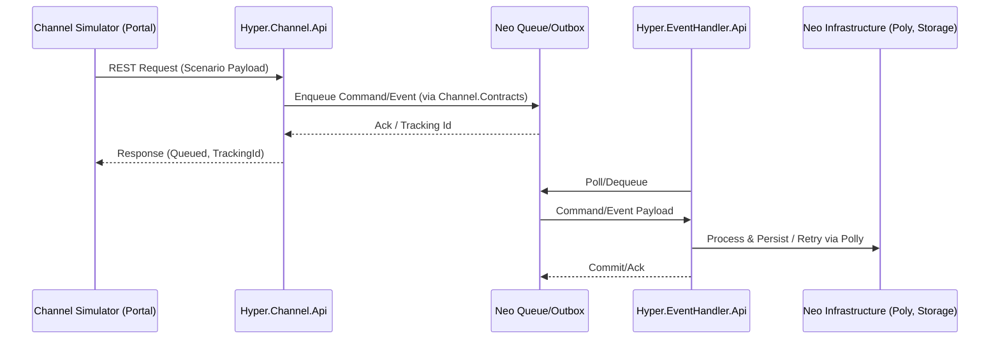

# Channel Integration Architecture

هدف این سند، توصیف ارتباط بین سه بخش اصلی سیستم «Channel Simulator» است:

1. **Channel Simulator Portal** (فرانت‌اند شبیه‌ساز)
2. **Hyper.Channel.Api** (بک‌اند صف‌بندی درخواست‌های کانال)
3. **Hyper.EventHandler.Api** (پردازش‌گر رویداد و مصرف‌کننده صف)

همچنین نقش `Hyper.Channel.Contracts` و زیرساخت Neo در مدیریت صف، Outbox و Retry بیان می‌شود.

---

## نمای کلی

---

## اجزای اصلی

### Channel Simulator Portal
- پیاده‌سازی با Next.js + TypeScript مشابه پرتال مشتریان.
- ارائه رابط برای تعریف سناریو، ارسال REST، مشاهده پاسخ و مانیتور وضعیت صف.
- استفاده از endpointهای Hyper.Channel.Api برای ایجاد رویداد، مصرف پاداش و سایر عملیات.
- ذخیره و بازپخش سناریوها برای تست خودکار.

### Hyper.Channel.Api
- لایه وب برای دریافت درخواست‌های REST از چنل‌ها / شبیه‌ساز.
- تبدیل ورودی به Command/Event استاندارد با استفاده از DTOهای `Hyper.Channel.Contracts`.
- مدیریت **Outbox Pattern**: ثبت درخواست در دیتابیس (یا storage زیرساخت Neo) قبل از قرار دادن در صف.
- قرار دادن پیام در صف Neo (یا جایگزین مورد توافق).
- پاسخ‌دهی به درخواست با شناسه رهگیری (TrackingId) و وضعیت پذیرش (Accepted/Rejected).
- ارائه APIهای وضعیت (مثلاً `/status/{trackingId}`) برای پیگیری پردازش.

### Hyper.EventHandler.Api
- سرویس مصرف‌کننده صف برای پردازش Command/Event ثبت شده توسط Channel.Api.
- استفاده از `Hyper.Channel.Contracts` برای دی‌سریال پیام.
- اجرای منطق تجاری (ثبت مصرف پاداش، تولید رویدادهای بعدی و ...)
- مدیریت Retry با استفاده از **Polly** یا ابزارهای معادل در Neo (Retry policy، Circuit breaker، Bulkhead).
- ثبت نتیجه پردازش (موفق/ناموفق) در دیتابیس یا سیستم مانیتورینگ.

---

## نقش Hyper.Channel.Contracts
- تعریف **DTO**، Command و Event جهت اشتراک بین Channel.Api و EventHandler.
- تضمین سازگاری بین سرویس‌ها با نسخه‌بندی و Contract تقویت شده.
- تسهیل Mapperها و Serializerهای یکسان در هر دو سرویس.
- پشتیبانی از واژگان مشترک مانند `ConsumeRewardCommand`, `ChannelEventMessage`, `QueueMetadata`.

---

## مدیریت صف و Outbox

### Outbox Pattern
- پیاده‌سازی در Channel.Api: قبل از ارسال پیام به صف، رکورد در Outbox ثبت می‌شود.
- پردازش Outbox می‌تواند توسط Background Service در Channel.Api یا Worker مستقل انجام شود.
- در صورتی که ذخیره‌سازی Outbox در Neo پشتیبانی نشود، نیاز به توسعه دارد یا باید جایگزینی مناسب در نظر گرفته شود.

### Queue
- اولویت با استفاده از قابلیت‌های صف در Neo (Priority Queue, Delay, Dead-letter).
- اگر Neo پاسخگوی نیازها نباشد، هماهنگی برای استفاده از راهکار سفارشی (Azure Service Bus, RabbitMQ, ...) الزامی است.

### Retry & Polly
- EventHandler.Api برای عملیات حساس (فراخوانی سرویس‌های دیگر، به‌روزرسانی دیتابیس) از Polly استفاده می‌کند:
  - سیاست Retry با Backoff تصاعدی
  - Circuit Breaker برای جلوگیری از تکرار خطاهای سیستماتیک
  - Timeout برای عملیات طولانی
- در صورت فراهم بودن امکانات هم‌تراز در Neo، می‌توان از Policyهای داخلی آن بهره برد.

---

## سناریوهای کلیدی

### 1. شبیه‌سازی مصرف پاداش
1. Portal درخواست `POST /rewards/consume` را به Channel.Api ارسال می‌کند.
2. Channel.Api ورودی را به `ConsumeRewardCommand` تبدیل و در Outbox ثبت می‌کند.
3. پیام در صف قرار می‌گیرد و شناسه رهگیری به Portal باز می‌گردد.
4. EventHandler پیام را خوانده، عملیات مصرف را انجام می‌دهد (مثلاً در زیرساخت Core).
5. وضعیت نهایی (موفق یا خطای قابل تکرار/غیرقابل تکرار) در Log/Monitoring ثبت می‌شود.
6. Portal می‌تواند با endpoint وضعیت، نتیجه را استعلام کند.

### 2. تولید رویداد کانال
1. Portal درخواست `POST /events` را می‌فرستد (مشابه رفتار یک کانال واقعی).
2. Channel.Api پیام را به `ChannelEventMessage` تبدیل و در صف منتشر می‌کند.
3. EventHandler پس از پردازش، رویدادهای ثانویه (Notification, Promotion) را فعال می‌کند.

---

## نیازمندی‌های غیرعملکردی

- **Observability**: لاگ ساختاریافته، Metrics و Distributed Tracing بین Portal → Channel.Api → EventHandler.
- **Security**: احراز هویت درخواست Portal (Token سرویس یا Keycloak). مدیریت Secrets در Azure KeyVault یا معادل.
- **Config Management**: استفاده از `appsettings` و `env` برای تنظیم آدرس‌های Neo، Retry Policy، زمان‌بندی Outbox.
- **Scalability**: Channel.Api و EventHandler باید افقی مقیاس‌پذیر باشند. توجه به idempotency در EventHandler.

---

## گام‌های بعدی پیشنهادی

1. تایید زیرساخت صف (Neo یا جایگزین).
2. تعیین قراردادهای اولیه در `Hyper.Channel.Contracts`.
3. ایجاد اسکلت پروژه Channel Simulator Portal و Endpointهای پایه Channel.Api.
4. طراحی Outbox و Service Background در Channel.Api.
5. پیاده‌سازی EventHandler با Retry Policy و Logging مناسب.
6. توسعه ابزارهای مانیتورینگ و Dashboard برای مشاهده وضعیت پردازش.

